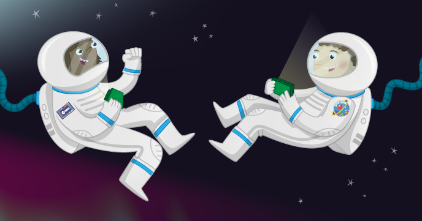

# Astronaut Reaction Times

For the first time ever, a British astronaut from the European Space Agency is going to live and work on the International Space Station. British ESA Astronaut Tim Peake is going to orbit the earth for half a year. But what is it like to live and work in space? This activity looks at reaction times for astronauts, and distances travelled by the International Space Station in that time, by creating a reaction times game in Scratch. 

You can learn more about what it is like to be an astronaut, and more about Tim Peake's mission, on [the UK National STEM Centre website here](http://www.nationalstemcentre.org.uk/timpeake).

## The worksheet

- Go to the [worksheet](worksheet.md)

## Community

Resource developed based on work by [ESERO-UK](http://www.esero.org.uk/) and [The National STEM Centre](http://www.nationalstemcentre.org.uk/) as part of the Astro Pi project. 

## Licence

Unless otherwise specified, everything in this repository is covered by the following licence:

***Astronaut Reaction Times*** by the [Raspberry Pi Foundation](http://www.raspberrypi.org) is licenced under a [Creative Commons Attribution 4.0 International License](http://creativecommons.org/licenses/by-sa/4.0/).

Based on a work at https://github.com/raspberrypilearning/astronaut-reaction-times
