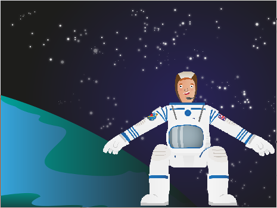

## Get started

--- task ---
Open the Scratch starter project.

**Online**: open the starter project at [rpf.io/astronaut-reacion-times](http://rpf.io/astronaut-reacion-timeson){:target="_blank"}.

**Offline**: download the [starter project](http://rpf.io/p/astronaut-reacion-times-go){:target="_blank"} and open it in the Scratch offline editor.

If you need to download and install the Scratch offline editor, download it from [rpf.io/scratchoff](http://rpf.io/scratchoff){:target="_blank"}.

In the starter project, you should see a space backdrop and an astronaut sprite.

--- /task ---

Things happen quickly when you’re travelling at 7.66 kilometers per second, and quick reaction times are essential when there is [space debris](https://en.wikipedia.org/wiki/Space_debris) to avoid.

<html>

</html>

Astronauts also need quick reactions and a steady hand, so that they can do tasks such as controlling robotic arms.
Astronauts are trained to speed up their reactions to incidents, and to prepare them for all eventualities. 

[NASA scientists have done experiments to test astronauts' reaction times.](http://www.nasa.gov/mission_pages/station/research/experiments/7.html)
Astronauts' reaction times were tested on the ground, then when they were on-board the ISS, and then when they returned to Earth. The experiment found that the astronauts took more than twice as long to react when they were in space. Scientists suggested that this could be caused by stress, and the brain having to adapt to microgravity. They also suggested that the astronauts' reaction times went back to normal soon after returning to Earth. 

Create a game in Scratch to test your reaction skills, to see if you could become an astronaut like Tim Peake.

