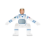

## Add a random pause

The game should not start straight away, and the start of the game should not be predictable.

--- task ---
Add some blocks to your program so that it waits for a random number of seconds before it starts to run, and then make the sprite say `GO!`.

--- hints --- --- hint ---
Add a `wait 1 seconds`{:class="block3control"} block and put a `pick random 1 to 10`{:class="block3operators"} block inside it.
--- /hint --- --- hint ---
Here are the two blocks you will need:

```blocks3
pick random (1) to (10)

wait (1) seconds
```
--- /hint --- --- hint ---
Here are the two blocks added into the program:

```blocks3
when flag clicked
say [Hello, British ESA Astronaut Tim Peake here. Let's test your reaction times!] for (2) seconds
wait (1) seconds
say [Press the Space key when I say "GO!"]
+ wait (pick random (1) to (10)) seconds
+ say [GO!]
```
--- /hint --- --- /hints ---
--- /task ---


