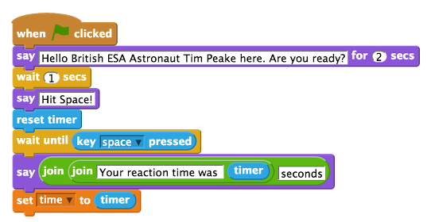
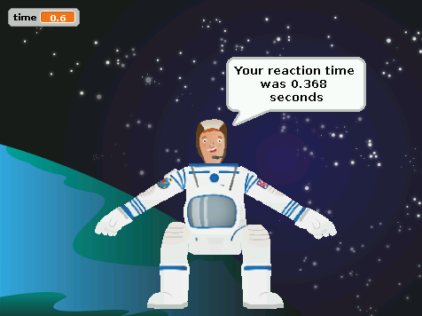

## Begin the reaction game script

- Click on your Sprite to select it in the sprites palette. 
- Select the `When green flag is clicked` control block from the blocks palette and place it onto the scripts area. 
- Then click on `Looks` and connect the `say for 2 secs` block to the first control block on the scripts area. Amend the text to say `Hello! British ESA Astronaut Tim Peake here. Are you ready?`.
- Add a `wait 1 secs` block underneath.
- Connect another `say` block and change the text to `Hit Space!`.
- Click on `Sensing` and connect the `reset timer` block.
	This will set the timer to 0 so that you will get an accurate measurement of how long it takes for someone to hit the space bar. 
- Use the `control` block `wait until` and place a `key space pressed?` sensing block inside the white space of the wait until block. 
	This will pause the program until the player presses the space bar. 
- Then connect another `say` block. Once the space bar has been pressed, you want to display the reaction to the player. To do this, you need to place an `operators` block called `join hello world` inside the white space in the say block. Replace the word `world` with the word `seconds`. 
- You will then need to replace the word `Hello` with another `join hello world` operators block, replacing the `Hello` text with `Your reaction time was` and the `world` text with the `timer` sensing block. 	
-  Finally, select the `set time to` block from the variables section and add it to your script. Place the `timer` sensing block inside where it reads `0`.

	
	
- Save your game and test it works by clicking on the green flag. When Tim says "Hit Space!", press the space bar. Your time should be displayed like this:
	
	

