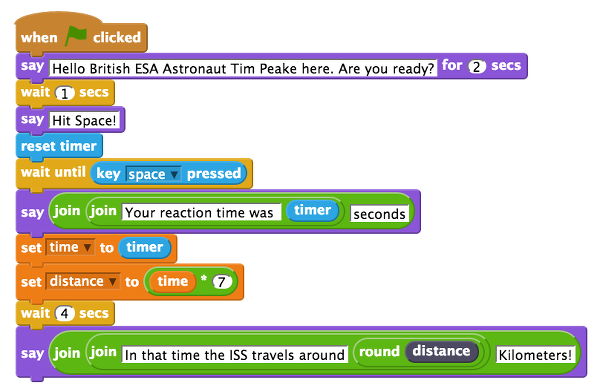
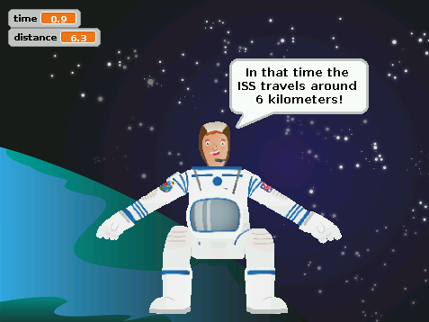

## Comparing player's reaction time to the ISS orbit

If you are happy with your reaction game and have tested that it works, then you can move onto adding to the script to compare the player's reaction time to how fast the ISS is travelling, to calculate how far it would travel in that time.

- First you will need to make a new variable called `distance` in the same way you did earlier.
- Attach a `set distance to` variable block to your script. Place an `operators` multiply block `0*0` inside where it reads `0`. 
	To calculate the distance travelled by the ISS you need to take the player's reaction time, which is stored in the time variable, and multiply it by 7. This is because on average the ISS travels 7 kilometres per second! 
- Add the `time` variable block into the right hand side of the multiplying operator and type `7` in the other side, so that the whole block reads `set distance to time * 7`.
- Next, add a `wait 4 seconds` control block.
- Then add a `say` block. As in the previous step, place a `join hello world` block inside. Replace `World` with `kilometres`. Insert another `join Hello World` block to replace `Hello`. Replace the `Hello` text in this new Join block with the text `In that time the ISS travels around`. Then replace `World` with a `round` operator block and fill the white space with the `distance` variable block like this:

	 	
	
- Save your game and test that it works by clicking on the green flag. 	
	
	
	
