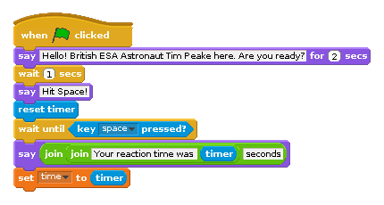
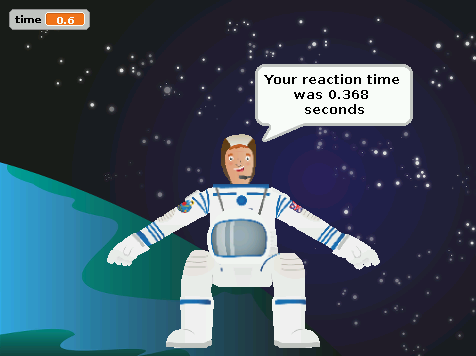
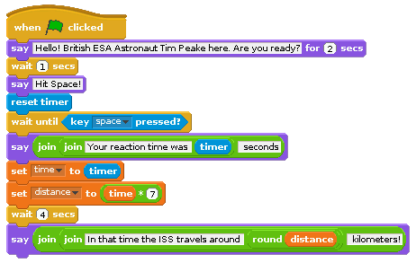

Things happen quickly when you’re travelling at 16,000 miles per hour (around
7,000 metres per second), and when debris and [micrometeoroids](http://www.esa.int/Our_Activities/Space_Engineering_Technology/Space_Environment/Micro-meteoroid_introduction) are heading towards you at around 22,500 miles per hour. Quick reactions and a steady
hand are also needed for tasks requiring fine motor skills, such as controlling robotic arms.
Astronauts are trained intensively to speed up their reactions to incidents, and
to prepare them for all eventualities. 

[NASA scientists have conducted experiments to test astronaut reaction times.](http://www.nasa.gov/mission_pages/station/research/experiments/7.html)
Astronauts were first tested using a computer system on the ground, then
again when they were on board the ISS, and once more when they returned. It
was found their reaction times more than doubled in space. Scientists suggest
that stress, as well as the brain having to adapt to microgravity, could be the
cause of this, and that normal performance was found soon after returning to Earth. 

You can learn more about what it is like to be an Astronaut and more about Tim Peake's mission on [the UK National STEM Centre website here](http://www.nationalstemcentre.org.uk/timpeake).

Let's create a game in Scratch to test your reaction skills and those of your friends and family to see if you could become an astronaut like British ESA Astronaut Tim Peake.

## Set the stage with a space theme

1. To begin, open a new file by selecting **File** and **New**.
1. Delete the Scratch Cat sprite by right clicking on it and selecting **Delete** from the menu that is displayed.
1. For this project, you need a space themed background and an Astronaut sprite. To add a background in Scratch click on `stage` in the sprites palette and then click on `Backgrounds` next to the `scripts` tab.
1. Click on `Paint` to draw your own background or `import` to use the same images as this resource. 
	Connect your Raspberry Pi to the internet, and download this [Space background](files/Space-background.png) and British EAS astronaut [Tim Peake sprite](files/Astronaut-Tim.png). Save them somewhere that you will be able to find them on your Raspberry Pi.  You can also find more images to use [here](files/) if you do not like those.
1. Next add a new sprite by clicking on the `import a new sprite` icon on the sprites palette (which looks like the image below) and select `Astronaut-Tim` from the choices and click **Ok**.

	
	
1. Save your Scratch project work by clicking on **File** and **Save As**. Name your progam `Astronaut Reaction Game` and save it in your home directory or some place that you can find it later.

## Create variables to store data

1. To create a variable, click on `Variables` in the `Blocks palette` and then click `Make a Variable`. The New Variable window opens and asks you to type a name for your variable.
1. Name the first variable `time` and ensure that `For all sprites` is checked before clicking **OK**.
	A variable holds a value that can be changed. The time variable you have created is an example of a value that can be changed and used inside different scripts. You will use it to store the reaction times of players. 
1. You’ll see some orange blocks added to your `Variables` area called `time`, and a small counter box will appear on the stage.

## Begin the reaction game script

1. Click on your Sprite to select it in the `Sprites Palette`. 
1. Select the `When green flag is clicked` control block from the `Blocks palette` and place it onto the `Scripts Area`. 
1. Then click on `Looks` and connect the `say for 2 secs` block to the first control block on the scripts area. Amend the text to say `Hello! British ESA Astronaut Tim Peake here. Are you ready?`
1. Add a `wait 1 secs` block underneath.
1. Connect another `say` block and change the text to `Hit Space!`.
1. Click on `Sensing` and connect the `reset timer` block.
	This will set the timer to 0 so that you will get an accurate measurement of how long it takes for someone to hit the space bar. 
1. Use the `control` block `wait until` and place a `key space pressed?` sensing block inside the white space of the wait until block. 
	This will pause the program until the player presses the space bar. 
1. Then connect another `say` block. Once the space bar has been pressed, you want to display the reaction to the player. To this, you need to place an `operators` block called `join hello world` inside the white space in the say block. Replace the word `world` with the word `seconds`. 
1. You will then need to replace the word `Hello` with another `join hello world` operators block. Replacing `Hello` text with `Your reaction time was` and the `world` text with the `timer` sensing block. 	
1.  Finally, select the `set time to` block from the variables section and add it to your script. Place the `timer` sensing block inside where it reads `0`.

	
	
1. Save your game and test it works by clicking on the green flag. When Tim says "Hit Space!", press the space bar. Your time should be displayed like this:
	
	

## Comparing players reaction time to the ISS orbit

If you are happy with your reaction game and have tested it works, then you can move onto adding to the script to compare the players' reaction time to how fast the ISS is travelling to calculate how far it would travel in that time.

1. First you will need to make a new viarble called `distance` in the same way you did earlier.
1. Attach a `set distance to` variable block to your script. Place an `operators` multiply block `0*0` inside where it reads `0`. 
	To calculate the diatnce travelled by the ISS you need to take the players reaction time which is stored in the time variable and multiply it by 7. This is because on average the ISS travels 7 kilometres per second! 
1. Add the `time` variable block into the right hand side of the multiplying operator and type `7` in the other side so that the whole block reads `set distance to time * 7`.
1. Next add a `wait 4 seconds` control block.
1. Then add a `say for 2 seconds` block. Like in the previous step, place a `join hello world` block inside. Replace "World" with `kilometers`. Insert another `join Hello World` block to replace "Hello". Replace the "Hello" text in this new Join block with the text `In that time the ISS travels around`. Then replace "World" with a `round ` operator block and fill the white space with the `distance` variable block like this:

	 	
	
1. Save your games and test that it works by clicking on the green flag. 	
	
	
	
## What next?

- You could make the game more interactive by getting the players name before they start and storing that information in a new `name` variable. Then you would be able to personalise the `say` blocks to include the players name.
- Using some of the other images, could you change the background and sprites to make the game more interesting?
- If you have a [Sense HAT](https://www.raspberrypi.org/products/sense-hat/), could you use it to trigger the timer instead of pressing the space bar?

